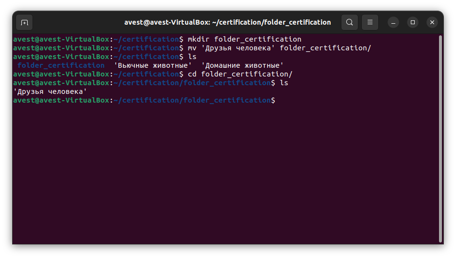
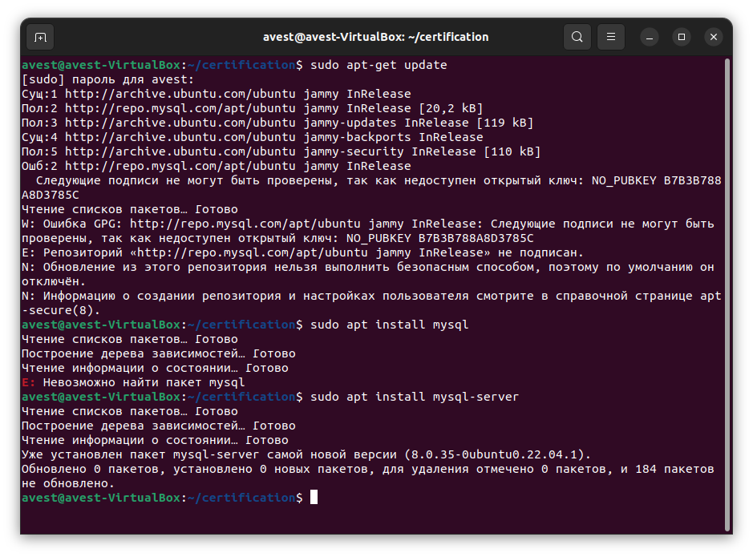
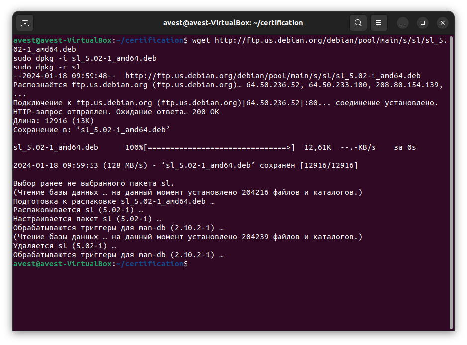
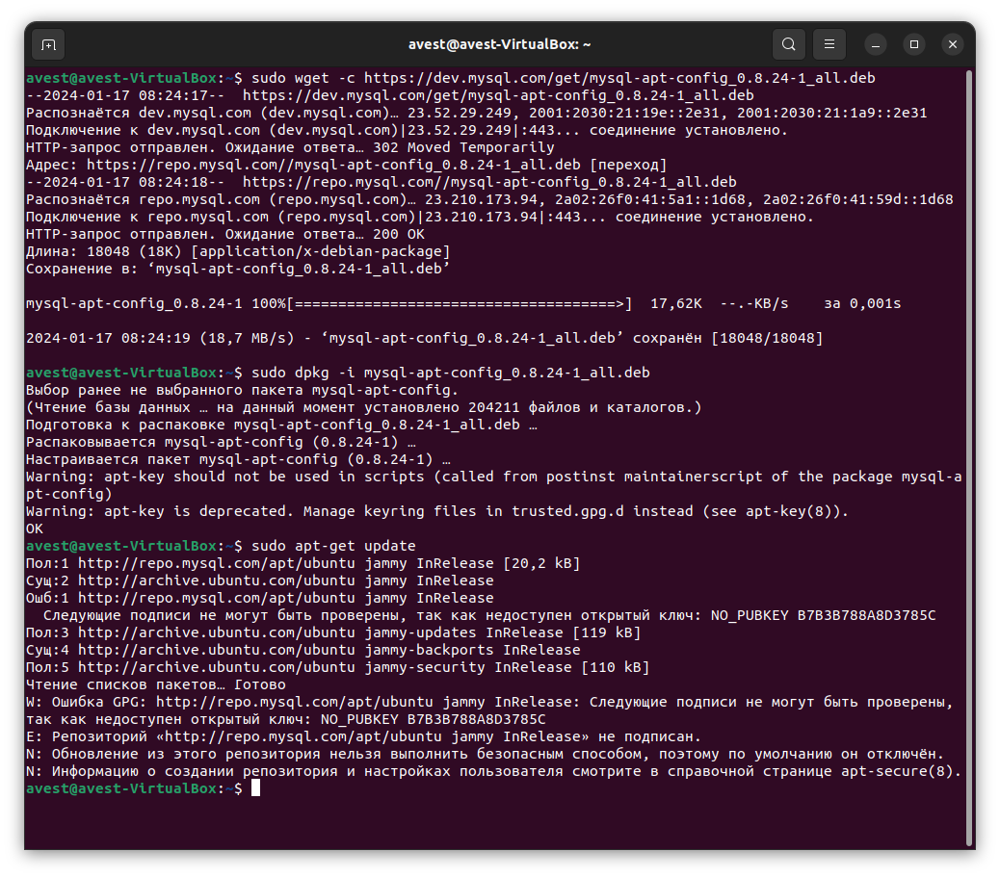
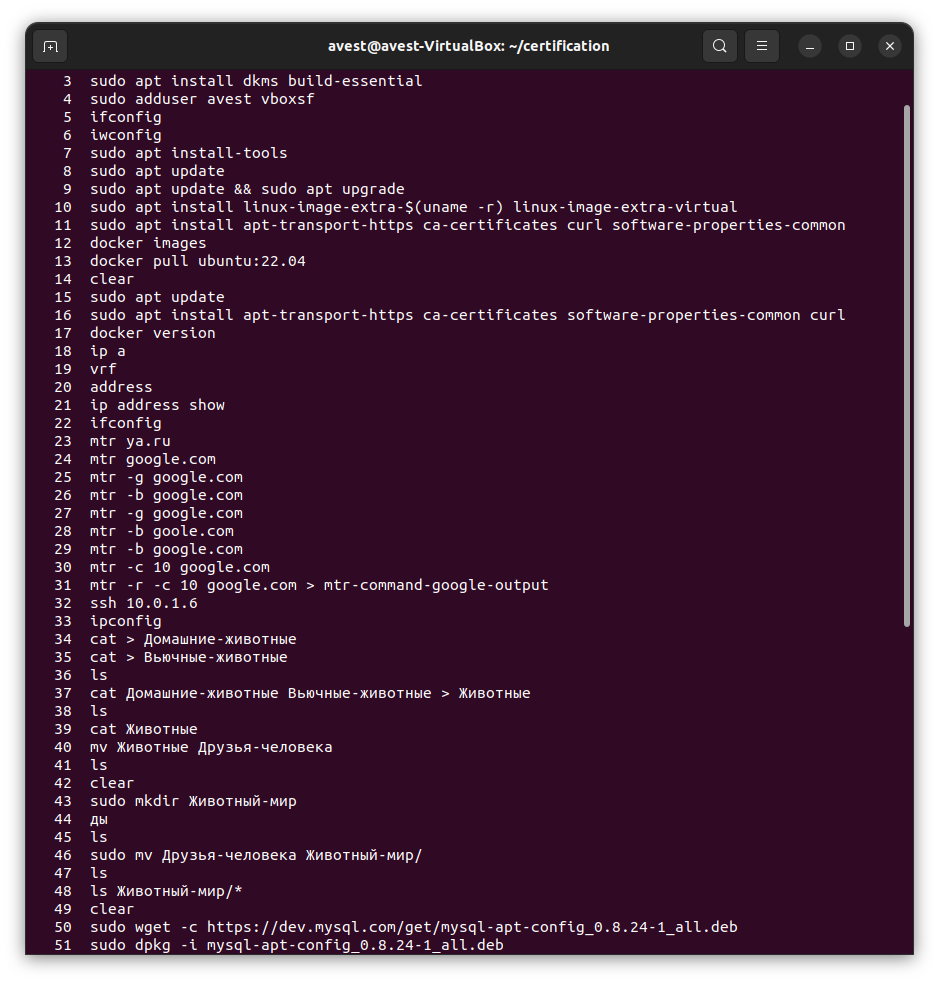
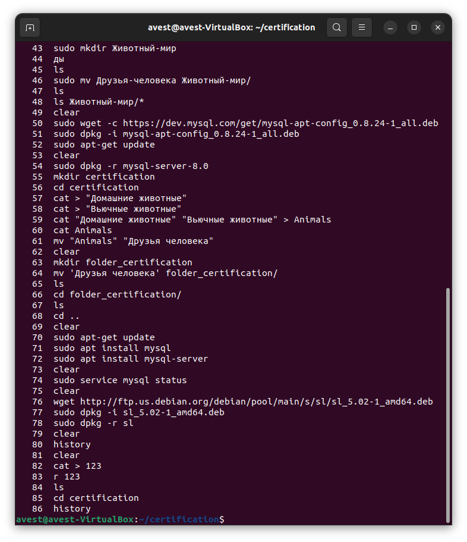

# Итоговая контрольная работа по блоку специализация


## Урок 2. Итоговая контрольная работа


**Информация о проекте**

* Необходимо организовать систему учета для питомника в котором живут домашние и вьючные животные.

**Как сдавать проект**

Для сдачи проекта необходимо создать отдельный общедоступный репозиторий (Github, Gitlub или Bitbucket).
Разработку вести в этом репозитории, использовать пул реквесты на изменения. Программа должна запускаться и работать,
ошибок при выполнении программы быть не должно. Программа может использоваться в различных системах, поэтому необходимо
разработать класс в виде конструктора.

### Задание

1. Используя команду cat в терминале операционной системы Linux, создать два файла "Домашние животные"
   (заполнив файл "собаками", "кошками", "хомяками") и "Вьючные животные" (заполнив файл "лошадьми", "верблюдами" и "
   ослами"),
   а затем объединить их. Просмотреть содержимое созданного файла. Переименовать файл, дав ему новое имя "Друзья
   человека".
2. Создать директорию, переместить файл туда.
3. Подключить дополнительный репозиторий MySQL. Установить любой пакет из этого репозитория.
4. Установить и удалить deb-пакет с помощью dpkg.
5. Выложить историю команд в терминале Ubuntu.
6. Нарисовать диаграмму, в которой есть классы - родительский, домашние животные и вьючные животные,
   в составы которых в случае домашних животных войдут классы: собаки, кошки, хомяки, а в класс вьючные животные войдут:
   лошади, верблюды и ослы.
7. В подключенном MySQL репозитории создать базу данных “Друзья человека”.
8. Создать таблицы с иерархией из диаграммы в БД.
9. Заполнить низкоуровневые таблицы именами (животных), командами которые они выполняют и датами рождения.
10. Удалить из таблицы верблюдов, т.к. верблюдов решили перевезти в другой питомник на зимовку.
    Объединить таблицы "лошади", и "ослы" в одну таблицу.
11. Создать новую таблицу "молодые животные" в которую попадут все животные старше 1 года, но младше 3 лет
    и в отдельном столбце, с точностью до месяца, подсчитать возраст животных в новой таблице.
12. Объединить все таблицы в одну, при этом сохраняя поля, указывающие на прошлую принадлежность к старым таблицам.
13. Создать класс с Инкапсуляцией методов и наследованием по диаграмме.
14. Написать программу, имитирующую работу реестра домашних животных.
    В программе должен быть реализован следующий функционал:

    14.1. Завести новое животное;

    14.2. Определять животное в правильный класс;

    14.3. Увидеть список команд, которое выполняет животное;

    14.4. Обучить животное новым командам;

    14.5. Реализовать навигацию по меню.

15. Создайте класс Счетчик, у которого есть метод add(), увеличивающий̆ значение внутренней̆ int переменной̆ на 1
    при нажатии “Завести новое животное”. Сделайте так, чтобы с объектом такого типа можно было работать в блоке
    try-with-resources.
    Нужно бросить исключение, если работа с объектом типа счетчик была не в ресурсном try и/или ресурс остался открыт.
    Значение считать в ресурсе try, если при заведения животного заполнены все поля.

### Решение

1.

<details>
    <summary>Команды Bash (развернуть)</summary>

```bash
cat > "Домашние животные"
Собаки
Кошки
Хомяки

'Ctrl+C'
```

```bash
cat > "Вьючные животные"
Лошади
Верблюды
Ослы

'Ctrl+C'
```

```bash
cat "Домашние животные" "Вьючные животные" > Animals
cat Animals
mv "Animals" "Друзья человека"
```

</details>


2.

<details>
    <summary>Команды Bash (развернуть)</summary>

```bash
mkdir folder_attestation
mv 'Друзья человека' folder_attestation/
ls
cd folder_attestation/
ls
```

</details>




3.

<details>
    <summary>Команды Bash (развернуть)</summary>

```bash
sudo apt-get update
sudo apt update
sudo apt install mysql-server
sudo service mysql status
```

</details>




4.

<details>
    <summary>Команды Bash (развернуть)</summary>

```bash
wget http://ftp.us.debian.org/debian/pool/main/s/sl/sl_5.02-1_amd64.deb
sudo dpkg -i sl_5.02-1_amd64.deb
sudo dpkg -r sl
```

</details>





5. История команд Ubuntu






6. Диаграмма


7.

```sql
CREATE DATABASE humanfriends;
```


8.

<details>
    <summary>SQL запросы (развернуть)</summary>

```sql
CREATE DATABASE humanfriends;
USE humanfriends;

create table cat (
	id INT NOT NULL AUTO_INCREMENT PRIMARY KEY,
    Name VARCHAR(45),
    Command VARCHAR(45),
    Birthday DATE
);

create table dog (
	id INT NOT NULL AUTO_INCREMENT PRIMARY KEY,
    Name VARCHAR(45),
    Command VARCHAR(45),
    Birthday DATE
);

create table hamster (
	id INT NOT NULL AUTO_INCREMENT PRIMARY KEY,
    Name VARCHAR(45),
    Command VARCHAR(45),
    Birthday DATE
);

create table horse (
	id INT NOT NULL AUTO_INCREMENT PRIMARY KEY,
	liftWeight INT,
    Name VARCHAR(45),
    Command VARCHAR(45),
	Birthday DATE
);

create table camel (
	id INT NOT NULL AUTO_INCREMENT PRIMARY KEY,
	liftWeight INT,
    Name VARCHAR(45),
    Command VARCHAR(45),
	Birthday DATE
);

create table donkey (
	id INT NOT NULL AUTO_INCREMENT PRIMARY KEY,
	liftWeight INT,
    Name VARCHAR(45),
    Command VARCHAR(45),
	Birthday DATE
);
```
</details>

9.

<details>
    <summary>Создадим таблицы уровня выше (развернуть)</summary>

```sql
create table pet (
	id INT NOT NULL AUTO_INCREMENT PRIMARY KEY,
    Name VARCHAR(45),
    Command VARCHAR(45),
    Birthday DATE
);

create table packAnimal (
	id INT NOT NULL AUTO_INCREMENT PRIMARY KEY,
    liftWeight INT,
    Name VARCHAR(45),
    Command VARCHAR(45),
    Birthday DATE
);

```
</details>

10.

<details>
    <summary>Создадим общую таблицу (развернуть)</summary>

```sql
create table humanFriend(
	id INT NOT NULL AUTO_INCREMENT PRIMARY KEY,
    Name VARCHAR(45),
    Command VARCHAR(45),
    Birthday Date
    );
```
</detaills>

<details>
    <summary>Заполним данными низкоуровневые таблицы (развернуть)</summary>

```sql
insert into cat (Name, Command, Birthday) values
    ('Милано', 'Спать', '2022-04-01'),
    ('Марсик', 'Спать', '2018-06-08'),
	('Феликс', 'Спать', '2023-07-08'),
    ('Аська', 'Спать', '2021-05-15');
    
    select * from cat;
    
	insert into dog (Name, Command, Birthday) values
    ('Бустер', 'Дай лапу', '2022-04-03'),
    ('Алый', 'Дай лапу', '2018-06-08'),
	('Гром', 'Дай лапу', '2023-04-06'),
    ('Дружок', 'Дай лапу', '2021-03-17');
	
    select * from dog;
    
insert into hamster (Name, Command, Birthday) values
    ('Ириска', 'Бежать', '2022-04-05'),
    ('Пушок', 'Бежать', '2017-05-08'),
	('Лапочка', 'Бежать', '2023-01-06'),
    ('Борчик', 'Бежать', '2021-04-15');
	
    select * from hamster;    
    
insert into camel (Name, Command, LiftWeight, Birthday) values
    ('Азира', 'Пошел', 100, '2022-03-04'),
    ('Дубай', 'Пошел', 200, '2018-07-09'),
	('Ланцелот', 'Пошел', 400, '2021-08-01'),
    ('Джордж', 'Пошел', 50, '2020-04-11');
	
    select * from camel;  
   р
    insert into horse (Name, Command, liftWeight, Birthday) values
    ('Морланд', 'Галоп', 150, '2022-04-07'),
    ('Рыжая', 'Галоп', 50, '2018-08-06'),
	('Крез', 'Галоп', 200, '2023-01-03'),
    ('Марацелло', 'Галоп', 250, '2021-03-11');
	
    select * from horse;    
    
	insert into donkey (Name, Command, liftWeight, Birthday) values
    ('Затана', 'Жевать', 45, '2022-04-08'),
    ('Барбос', 'Жевать', 15, '2018-06-09'),
	('Блеки', 'Жевать', 20, '2023-02-06'),
    ('Жерар', 'Жевать', 100, '2021-08-14');
	
    select * from donkey;    
    
```
</detaills>

10.1

<details>
    <summary>Удаляем таблицы верблюдов (развернуть)</summary>

```sql
 delete from camel where id > 0;
 select * from camel;    
```

</details>

10.2

<details>
    <summary>Объединеним таблицы лошадей и ослов в одну таблицу. (развернуть)</summary>

```sql
create table packAnimalNew (id INT NOT NULL AUTO_INCREMENT PRIMARY KEY)
select  Name, 
        Command, 
        Birthday
from horse union 
select  Name, 
        Command, 
        Birthday
from donkey;

select * from packAnimalNew;

```

</details>

11.

<details>
    <summary>Создадим таблицы, в которой все животные в возрасте от 1 до 3 лет. (развернуть)</summary>

```sql
INSERT into pet (Name, Command, Birthday)
select  Name, 
        Command, 
        Birthday
from cat union 
select  Name, 
        Command, 
        Birthday
from dog union
select  Name, 
        Command, 
        Birthday
from hamster;
select * from pet;

INSERT into humanFriend (Name, Command, Birthday)
select  Name, 
        Command, 
        Birthday
from pet union 
select  Name, 
        Command, 
        Birthday
from packAnimalNew;
select * from humanFriend;

create table youngAnimals (id INT NOT NULL AUTO_INCREMENT PRIMARY KEY)
select Name, 
        Command, 
        Birthday,
        Round((year(current_date()) - year(Birthday)) + (month(current_date() - month(Birthday)))/10, 2) as age
from humanFriend
where Round((year(current_date()) - year(Birthday)) + (month(current_date() - month(Birthday)))/10, 2) > 1 
	and Round((year(current_date()) - year(Birthday)) + (month(current_date() - month(Birthday)))/10, 2) < 3;
select * from youngAnimals; 


```
</details>
12
<details>
    <summary>Объединим все таблицы в одну, при этом сохраняя поля, указывающие на прошлую принадлежность к старым таблицам.. (развернуть)</summary>

```sql

create table newhumanFriend (id INT NOT NULL AUTO_INCREMENT PRIMARY KEY)
select  Name, 
        Command,
        Birthday,
        'cat' as oldTable
from cat union 
select  Name, 
        Command, 
        Birthday,
        'dog' as oldTable
from dog union
select  Name, 
        Command, 
        Birthday,
        'hamster' as oldTable
from hamster union 
select  Name, 
        Command, 
        Birthday,
        'horse' as oldTable
from horse union 
select  Name, 
        Command, 
        Birthday,
        'donkey' as oldTable
from donkey;

select * from newhumanFriend;

```

</details>

13. , 14. , 15. - -= Перейти к коду Java =-


*Подготовил студент Geek Brains* [**`Aleksandr Bektin`**](https://gb.ru/users/7696463) GB_certification
